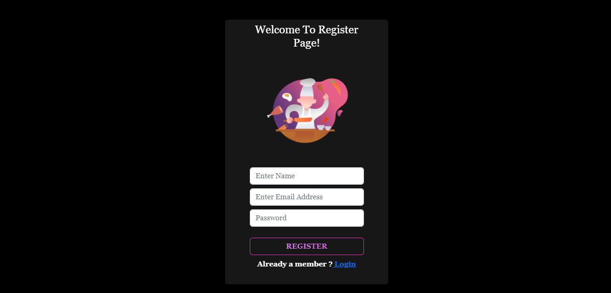
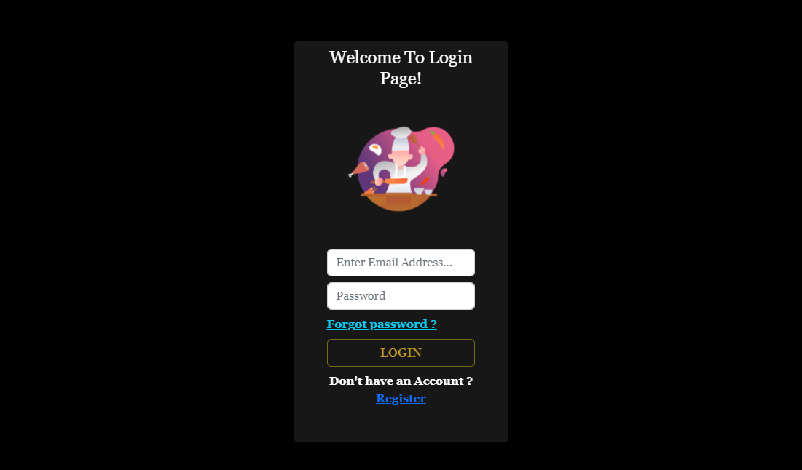

<h1>Hello Everyone..!<h1/>

Creating a App for<strong> "RECIPES BUDDY"<strong/>

 
  

   Please Clik -> to view Our Yummy Recipes :
    <a href="https://recipes-buddy-frontend.netlify.app" target="_blank">Recipes Buddy<a/>
  

<h5>Attach App image's<h5/>
<h3>Login Page</h3>

 
<h3>Registration Page</h3>

